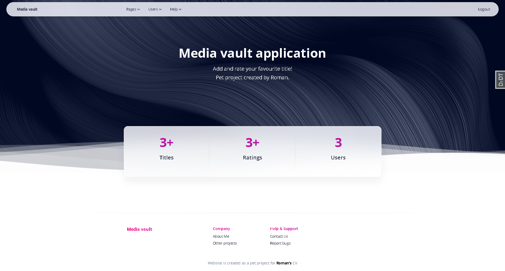
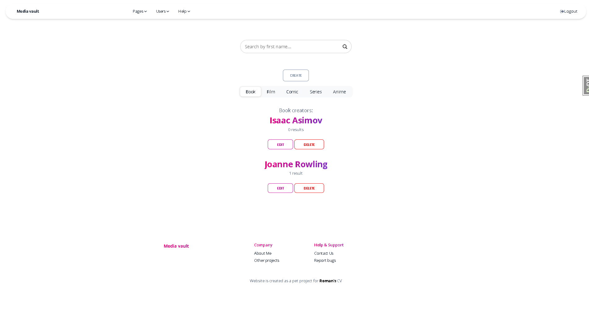
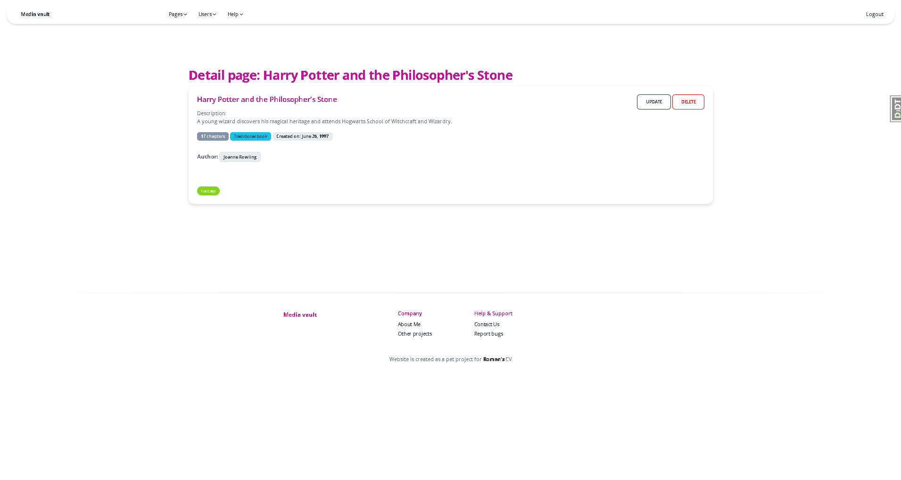

# media-vault — README

**A media collection and discovery app, built with Django.**

`media-vault` is a web application that allows users to catalog and manage media—such as films, books, and series—through adding titles, filtering by genre, creator, and status, rating items, and exploring lists. It includes dynamic features like AJAX-powered modals for quickly creating creators, and context-aware redirects that enhance the user experience.

---

## Table of Contents

- [Project Overview](#project-overview)  
- [What the App Does](#what-the-app-does)  
- [Quick Start (Development)](#quick-start-development)  
- [Running Tests & Measuring Coverage](#running-tests--measuring-coverage)  
- [AJAX & Modal Behavior](#ajax--modal-behavior)
- [License & Contact](#license--contact)  
- [Database diagram](#database-diagram)
- [screenshots](#screenshots)

---

## Project Overview

`media-vault` is a Django-powered media library that helps users organize and share their media collections. It provides:

- Django models for media items, creators, genres, and user ratings.  
- List, create, update, and delete views for media, creators, and ratings.  
- Filtering functionality based on title, genre, creator, status, and type.  
- AJAX modals for adding new creators without leaving the form.  
- Form handling that supports both traditional and AJAX submissions.  
- Thorough test coverage and fixtures for sample data development.  

---

## What the App Does

- **Catalog media** — Users can add films, books, and series, with metadata such as creators, genres, types, and status.  
- **Filter and search** — Users can filter media lists by creator, genre, and status or search by title.  
- **Rate media** — Users can provide ratings, and media lists display aggregated averages.  
- **Create creators via modal** — In-place modals let users add new creators while filling out media forms.  
- **Smart redirects** — Views redirect users either to the creator list, detail view, or specified `next` page depending on context.  

---

## Quick Start (Development)

```
1. git clone https://github.com/RomanSapunGit/media-vault.git
2. cd media-vault
3. python -3.10 -m venv .venv
4. . venv/Scripts/activate
5. pip install -r requirements.txt
6. python manage.py migrate
7. python manage.py loaddata media_vault_db_data.json
8. python manage.py runserver

9. Navigate to local server with your specific port to explore (example: http://127.0.0.1:8000/)
```

## Running Tests & Measuring Coverage

### Using Django Test Runner
`python manage.py test`

### Measuring Coverage
```
coverage run --source='.' manage.py test or coverage run manage.py test
coverage report
coverage html 
```

## AJAX & Modal Behavior
**CreatorCreateView** supports both standard and AJAX submissions:

- **Normal POST**: redirects to creator_list.

- **AJAX POST** (with X-Requested-With: XMLHttpRequest header): returns JSON — { success: true, author: { id, name } } or { success: false, form_html }.

The frontend JS captures this JSON to dynamically update forms without a full reload.

## License & Contact
No license file is currently included.
For clarification or contributions, please contact the repository owner via GitHub: RomanSapunGit/media-vault.

## Database diagram
<details>
<summary>Database diagram</summary>


</details> 

## screenshots
### Index page
<details>
<summary>Index page</summary>


</details>

### Books list page
<details>
<summary>Books list page</summary>


</details> 

### Films list page
<details>
<summary>Films list page</summary>


</details> 

### Series list page
<details>
<summary>Series list page</summary>


</details> 

### Genres list page
<details>
<summary>Genres list page</summary>


</details> 

### Creators list page
<details>
<summary>Creators list page</summary>


</details> 

### Users list page
<details>
<summary>Users list page</summary>


</details> 

### Ratings list page
<details>
<summary>Ratings list page</summary>


</details> 

### User detail page
<details>
<summary>User detail page</summary>


</details> 

### Rating detail page
<details>
<summary>Rating detail page</summary>


</details> 

### Book detail page
<details>
<summary>Book detail page</summary>


</details> 

### Film detail page
<details>
<summary>Film detail page</summary>


</details> 

### Series detail page
<details>
<summary>Series detail page</summary>


</details> 

### Book update page
<details>
<summary>Book update page</summary>


</details> 

### Film update page
<details>
<summary>Film update page</summary>


</details> 

### Series update page
<details>
<summary>Series update page</summary>


</details> 

### Delete modal (similar to all models)
<details>
<summary>Delete modal</summary>


</details> 

### Create author modal (in all media)
<details>
<summary>Create author modal</summary>


</details> 