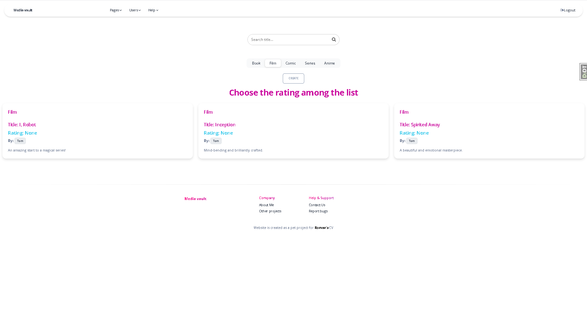

# media-vault

`media-vault` is a web application that allows users to catalog and manage media—such as films, books, and series—through adding titles, filtering by genre, creator, and status, rating items, and exploring lists. It includes dynamic features like AJAX-powered modals for quickly creating creators, and context-aware redirects that enhance the user experience.

## Installing / Getting started

A quick introduction of the minimal setup you need to get an app up &
running.

```shell
1. git clone https://github.com/RomanSapunGit/media-vault.git
2. cd media-vault
3. python -3.10 -m venv .venv
4. . venv/Scripts/activate
5. pip install -r requirements.txt
6. python manage.py migrate
7. python manage.py loaddata media_vault_db_data.json
8. python manage.py runserver

9. Navigate to local server with your specific port to explore (example: http://127.0.0.1:8000/)
```

It should install necessary libraries, set up venv, migrations and run server.

## Developing

Here's a brief intro about what a developer must do in order to start developing
the project further:

```shell
git clone https://github.com/RomanSapunGit/media-vault.git
cd media-vault/
```

And state what happens step-by-step.

### Building

No explicit build step is required for `media-vault` because it’s a Django web app.

## Features

`media-vault` offers a full suite of tools for managing and exploring personal media collections:

- **Catalog media** — Add films, books, and series with detailed metadata (title, creator, genre, type, status).  
- **Filter and search** — Quickly find items by title, creator, genre, type, or completion status.  
- **Rate media** — Provide ratings, view aggregated averages.  
- **Create creators via modal** — Add new creators directly from media forms using AJAX-powered modals without leaving the page.  
- **Smart redirects** — Context-aware navigation that returns you to the right place after creating or editing an item.  
- **Sample data** — Built-in fixtures for quick local testing and demonstration of the app.  
- **Fully tested** — Unit tests for views, models, and forms ensure stability and easy maintenance. 

## Configuration

Before running `media-vault`, you can adjust the application’s behavior through environment variables and Django settings.

### Environment Variables

These can be set in a `.env` file or in your shell before starting the server:


#### `SECRET_KEY`
Type: String  
Default: `django-insecure-d!z7!hh)4ly^*g#n(vapvlqs51onqs!o-b)hqhs%j&v_!bpguy`

Django secret key. **Must be set for production**

## Contributing

Contributions are warmly welcome! Whether you’ve found a bug, have an idea for a feature, or want to improve the documentation, your help is appreciated.

If you’d like to contribute:

1. **Fork** the repository.
2. **Create** a new feature branch:  
   ```shell
   git checkout -b feature/your-feature-name
   ```
3. **Commit** your changes:  
   ```shell
   git commit -m "Add(scope): short description of changes"
   ```
4. **Push** to your branch:  
   ```shell
   git push origin feature/your-feature-name
   ```
5. **Open a Pull Request** describing your changes and their purpose.

### Code Style Guidelines
- Follow [PEP 8](https://peps.python.org/pep-0008/) for Python code.
- Write descriptive commit messages (e.g., `Fix(user register): adjust modal form validation`).
- Add or update tests for any changes in functionality.
- Run the test suite before submitting your PR:  
  ```shell
  python manage.py test
  ```

If you plan to make significant changes, please open an **issue** first to discuss your ideas.

### Measuring Coverage

To see what parts of code are covered by tests you can use [coverage](https://coverage.readthedocs.io/en/7.10.3/) library:
```
coverage run --source='.' manage.py test or coverage run manage.py test
coverage report
coverage html 
```

## Links & Screenshots

- **Project homepage:** *No homepage yet!*
- **Repository:** [https://github.com/RomanSapunGit/media-vault](https://github.com/RomanSapunGit/media-vault)
- **Issue tracker:** [https://github.com/RomanSapunGit/media-vault/issues](https://github.com/RomanSapunGit/media-vault/issues)  
  - For sensitive bugs such as security vulnerabilities, please contact **teg481275@gmail.com** directly instead of using the public issue tracker.  
    We value your effort to improve the security and privacy of this project!
- **Related projects:**
  - *None listed yet — feel free to suggest related tools or integrations!*

### Screenshots

## Database diagram
<details>
<summary>Database diagram</summary>


</details> 

## screenshots
### Index page
<details>
<summary>Index page</summary>


</details>

### Books list page
<details>
<summary>Books list page</summary>


</details> 

### Films list page
<details>
<summary>Films list page</summary>


</details> 

### Series list page
<details>
<summary>Series list page</summary>


</details> 

### Genres list page
<details>
<summary>Genres list page</summary>


</details> 

### Creators list page
<details>
<summary>Creators list page</summary>


</details> 

### Users list page
<details>
<summary>Users list page</summary>


</details> 

### Ratings list page
<details>
<summary>Ratings list page</summary>


</details> 

### User detail page
<details>
<summary>User detail page</summary>


</details> 

### Rating detail page
<details>
<summary>Rating detail page</summary>


</details> 

### Book detail page
<details>
<summary>Book detail page</summary>


</details> 

### Film detail page
<details>
<summary>Film detail page</summary>


</details> 

### Series detail page
<details>
<summary>Series detail page</summary>


</details> 

### Book update page
<details>
<summary>Book update page</summary>


</details> 

### Film update page
<details>
<summary>Film update page</summary>


</details> 

### Series update page
<details>
<summary>Series update page</summary>


</details> 

### Delete modal (similar to all models)
<details>
<summary>Delete modal</summary>


</details> 

### Create author modal (in all media)
<details>
<summary>Create author modal</summary>


</details> 

## Licensing

No license file is currently included.
For clarification or contributions, please contact the repository owner via GitHub: RomanSapunGit/media-vault.
